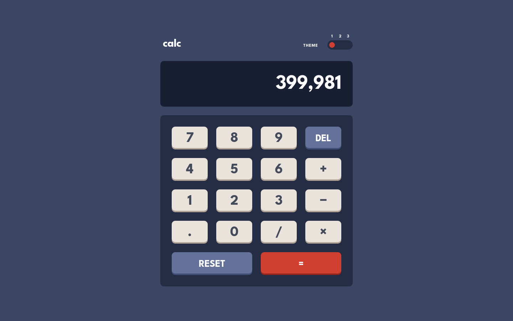
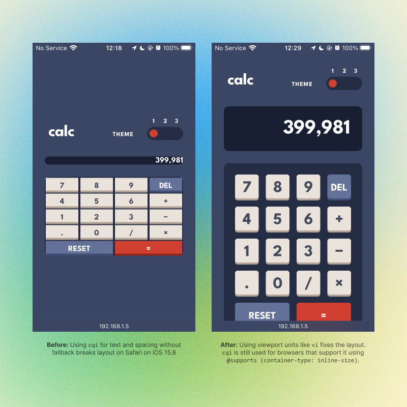

# Frontend Mentor - Calculator app solution

This is a solution to the [Calculator app challenge on Frontend Mentor](https://www.frontendmentor.io/challenges/calculator-app-9lteq5N29). Frontend Mentor challenges help you improve your coding skills by building realistic projects.

## Table of contents

- [Overview](#overview)
  - [The challenge](#the-challenge)
  - [Screenshot](#screenshot)
  - [Links](#links)
- [My process](#my-process)
  - [Built with](#built-with)
  - [What I learned](#what-i-learned)
  - [Continued development](#continued-development)
  - [Useful resources](#useful-resources)
- [Author](#author)
- [Acknowledgments](#acknowledgments)

## Overview

### The challenge

Users should be able to:

- [x] See the size of the elements adjust based on their device's screen size
- [ ] Perform mathmatical operations like addition, subtraction, multiplication, and division
- [x] Adjust the color theme based on their preference
- [x] **Bonus**: Have their initial theme preference checked using `prefers-color-scheme` and have any additional changes saved in the browser

### Screenshot



### Links

- Solution URL: [Add solution URL here](https://your-solution-url.com)
- Live Site URL: [Add live site URL here](https://your-live-site-url.com)

## My process

### Built with

- Semantic HTML5 markup
- CSS custom properties for design tokens (see [_base.css]())
- [A (more) modern CSS reset](https://piccalil.li/blog/a-more-modern-css-reset/)
- [11ty](https://www.11ty.dev/) - simpler static site generator
- [Lightning CSS](https://lightningcss.dev/) - CSS bundler
- [esbuild](https://esbuild.github.io/) - JS bundler

### What I learned

#### [CSS container query units are not supported in Safari on iOS <= 15.8](https://caniuse.com/css-container-query-units)

For context, I'm using an iPhone SE (1st gen) for mobile testing on my projects, which is nice because I also get to check if my work is accessible on an old device. I was so frustrated at first because the display and keypad layout stays broken even though it looks good on desktop.



It took me a while to figure out that the issue was caused by the container query units that I used for the fluid type and spacing. My first idea was to use a [container query polyfill](https://github.com/GoogleChromeLabs/container-query-polyfill), but I couldn't make it work. So I went the progressive enhancement approach: use `vi` for fluid values, and then conditionally override these with `cqi` for browsers that support container queries.

```css
/* fluid values are initially implemented using vi */
--fluid-10-24: clamp(0.625rem, -0.4198rem + 5.2239vi, 1.5rem);

/* then switch to cqi for browsers that support container queries */
@supports (container-type: inline-size) {
  --fluid-10-24: clamp(0.625rem, -0.6477rem + 6.3636cqi, 1.5rem);
}
```

Why not use viewport units exclusively? Adding support for container query units means I can use this calculator component in other contexts. For example, in the future I can place it in the sidebar of my blog and it will still have responsive type and spacing.

#### Implementing a progressively-enhanced 3-way theme toggle switch component

Even though this is a secondary feature, I actually worked on this first, but only because I've already built a [calculator](https://github.com/joshjavier/calculator) before and am already familiar with the JavaScript implementation.

Building this was fun! Here's a quick breakdown:

- For the HTML, I used a fieldset of radio buttons since the functionality we need to build (selecting a theme will deselect the previous theme) is most closely resembled by radio buttons (only one radio button in a set can be selected at a time).

- For the CSS, I replaced the default browser styles with a custom one according to the design. The switch handle is an SVG circle that moves along the switch track to match the currently selected theme.

- For the JavaScript, I wrote functions for storing the theme state, saving/loading the theme preference to/from local storage, and updating the `data-theme` attribute in the `<html>` to reflect the current theme.

- For progressive enhancement, I created a `DraggableSwitch` class that makes the handle draggable, but retains the native radio button functionality.

I also learned to leverage the [asset bucketing](https://www.11ty.dev/docs/languages/webc/#asset-bucketing) feature of Eleventy and WebC to [prevent color flashes](https://web.dev/articles/building/a-theme-switch-component#the_page_load_experience) when reloading the page. See [theme-switch.webc]() to get a closer look.

<!-- ### Continued development

Use this section to outline areas that you want to continue focusing on in future projects. These could be concepts you're still not completely comfortable with or techniques you found useful that you want to refine and perfect.

**Note: Delete this note and the content within this section and replace with your own plans for continued development.** -->

### Useful resources

- [Building a switch component](https://web.dev/articles/building/a-switch-component) and [Building a theme switch component](https://web.dev/articles/building/a-theme-switch-component) - These two articles, both by Adam Argyle, were the primary inspiration for my implementation of the calculator's theme switcher. Adam did a brillient job explaining not only the *how* but also the *why*, which helped me combine these concepts into a progressively-enhanced 3-way theme toggle switch component.
- [Inclusively Hiding & Styling Checkboxes and Radio Buttons](https://www.sarasoueidan.com/blog/inclusively-hiding-and-styling-checkboxes-and-radio-buttons/) - I always reference this whenever I have to add custom styling to checkboxes or radio buttons.

## Author

<!-- - Website - [Josh Javier](https://joshjavier.com/) -->
- Frontend Mentor - [@joshjavier](https://www.frontendmentor.io/profile/joshjavier)
- Twitter - [@joshjavierr](https://www.twitter.com/joshjavierr)

<!-- ## Acknowledgments

This is where you can give a hat tip to anyone who helped you out on this project. Perhaps you worked in a team or got some inspiration from someone else's solution. This is the perfect place to give them some credit.

**Note: Delete this note and edit this section's content as necessary. If you completed this challenge by yourself, feel free to delete this section entirely.** -->
